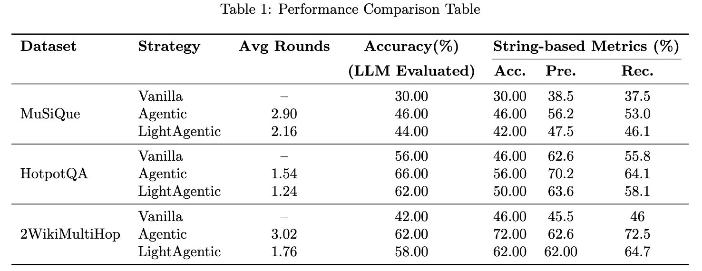

# Agentic RAG

A modular and extensible implementation of Agentic Retrieval-Augmented Generation (RAG) - the next evolution in RAG systems that employs an iterative, agent-based approach to information retrieval and generation.

## Key Features

- **Research Prototype** - A minimal viable implementation for experimentation and academic exploration
- **Modular Architecture** - Clean, decoupled codebase designed for easy customization and extension
- **Multiple RAG Models** - Supports multiple RAG implementations with standardized interfaces
- **Extensible** - Easily add new RAG algorithms to the framework


## Installation and Configuration

- Python 3.8+ required
- Install dependencies:
```bash
pip install -r requirements.txt
```
- Set your OpenAI API key as an environment variable:
```bash
# For Linux/Mac
export OPENAI_API_KEY=your_api_key_here

# For Windows (Command Prompt)
set OPENAI_API_KEY=your_api_key_here

# For Windows (PowerShell)
$env:OPENAI_API_KEY="your_api_key_here"
```
- Other configuration options can be modified in `config/config.py`


## Quick start

### Running Evaluation on a Dataset

To evaluate a specific RAG model on a dataset:

```bash
python run.py --model MODEL_NAME --dataset path/to/dataset.json --corpus path/to/corpus.json
```

Available models:
- `vanilla`: Traditional single-step RAG approach
- `agentic`: Standard AgenticRAG with iterative retrieval
- `light`: Memory-efficient LightAgenticRAG implementation

Options:
- `--max-rounds`: Maximum number of agent retrieval rounds (default: 3)
- `--top-k`: Number of top contexts to retrieve (default: 5)
- `--eval-top-ks`: List of k values for top-k accuracy evaluation (default: 5 10)
- `--limit`: Number of questions to evaluate (default: 20)
- `--output`: Output file name for results (default: evaluation_results.json)

### Running a Single Question

To run a single question through any RAG model:

```bash
python run.py --model MODEL_NAME --question "Your question here" --corpus path/to/corpus.json
```

### Using the Script

For convenience, you can use the provided script to run evaluations with specific RAG models on all datasets:

```bash
# Run evaluations with vanilla RAG on all datasets
./scripts/run.sh

# Run evaluations with LightAgenticRAG on all datasets 
./scripts/run.sh --model light
```


## Results




## Components

| Component | Features/Description |
|-----------|---------------------|
| **BaseRAG** | • Loading and processing document corpus<br>• Computing and caching document embeddings<br>• Basic retrieval functionality |
| **VanillaRAG** | • Single retrieval step for relevant contexts<br>• Direct answer generation from retrieved contexts |
| **AgenticRAG** | • Multiple retrieval rounds with iterative refinement<br>• Reflection on retrieved information to identify missing details<br>• Generation of focused sub-queries for additional retrieval<br>• Final answer generation from comprehensive context |
| **LightAgenticRAG** | • Memory-efficient implementation of AgenticRAG<br>• Optimized for running on systems with limited resources |
| **Evaluation** | • Answer accuracy (LLM evaluated)<br>• Retrieval metrics<br>• Performance efficiency<br>• String-based evaluation metrics |

## Adding a New RAG Model

To add a new RAG algorithm:

1. Create a new class that extends `BaseRAG` in the `src/models` directory
2. Implement the required methods (`answer_question` at minimum)
3. Add your model to the `RAG_MODELS` dictionary in `src/main.py`

```python
# Example of a new RAG model
from src.models.base_rag import BaseRAG

class MyNewRAG(BaseRAG):
    def answer_question(self, question: str):
        # Implementation here
        return answer, contexts
```

## Example Usage

```python
from src.models.agentic_rag import AgenticRAG

# Initialize RAG system
rag = AgenticRAG('path/to/corpus.json')
rag.set_max_rounds(3)
rag.set_top_k(5)

# Ask a question
answer, contexts, rounds = rag.answer_question("What is the capital of France?")
print(f"Answer: {answer}")
print(f"Retrieved in {rounds} rounds")
``` 

