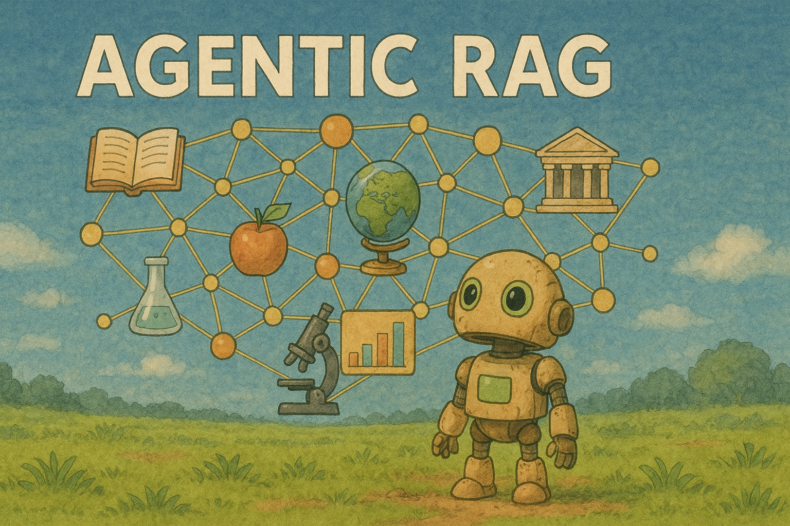

# Agentic RAG

A modular and extensible implementation of Agentic Retrieval-Augmented Generation (RAG) - the next evolution in RAG systems that employs an iterative, agent-based approach to information retrieval and generation.

## Key Features

- **Research Prototype** - A minimal viable implementation for experimentation and academic exploration
- **Modular Architecture** - Clean, decoupled codebase designed for easy customization and extension
- **Comparative Evaluation** - Comprehensive evaluation metrics to benchmark RAG approaches




## Installation and Configuration

- Python 3.8+ required
- Install dependencies:
```bash
pip install -r requirements.txt
```
- Create a `.env` file in the root directory based on `.env.example`:
```bash
cp .env.example .env
```
- Edit `.env` file to set your OpenAI API key:
```
OPENAI_API_KEY=your_actual_api_key_here
```
- Additional configuration options can be found in `config/config.py`


## Quick start

### Running Evaluation

To compare the AgenticRAG and VanillaRAG approaches on a dataset:

```bash
python main.py --dataset path/to/dataset.json --corpus path/to/corpus.json
```

Options:
- `--max-rounds`: Maximum number of agent retrieval rounds (default: 3)
- `--top-k`: Number of top contexts to retrieve (default: 5)
- `--limit`: Number of questions to evaluate (default: 20)
- `--output`: Output file name for results (default: agent_vs_vanilla_comparison.json)

### Running a Single Query

To run a single question through the AgenticRAG system:

```bash
python main.py --mode agentic --question "Your question here" --corpus path/to/corpus.json
```

To run a single question through the VanillaRAG system:

```bash
python main.py --mode vanilla --question "Your question here" --corpus path/to/corpus.json
```

## Components

| Component | Features/Description |
|-----------|---------------------|
| **BaseRAG** | • Loading and processing document corpus<br>• Computing and caching document embeddings<br>• Basic retrieval functionality |
| **VanillaRAG** | • Single retrieval step for relevant contexts<br>• Direct answer generation from retrieved contexts |
| **AgenticRAG** | • Multiple retrieval rounds with iterative refinement<br>• Reflection on retrieved information to identify missing details<br>• Generation of focused sub-queries for additional retrieval<br>• Final answer generation from comprehensive context |
| **Evaluation** | • Answer accuracy (LLM evaluated)<br>• Retrieval metrics<br>• Performance efficiency<br>• String-based evaluation metrics |

## Example

```python
from agentic_rag import AgenticRAG

# Initialize RAG system
rag = AgenticRAG('path/to/corpus.json')
rag.set_max_rounds(3)
rag.set_top_k(5)

# Ask a question
answer, contexts, rounds = rag.answer_question("What is the capital of France?")
print(f"Answer: {answer}")
print(f"Retrieved in {rounds} rounds")
``` 

